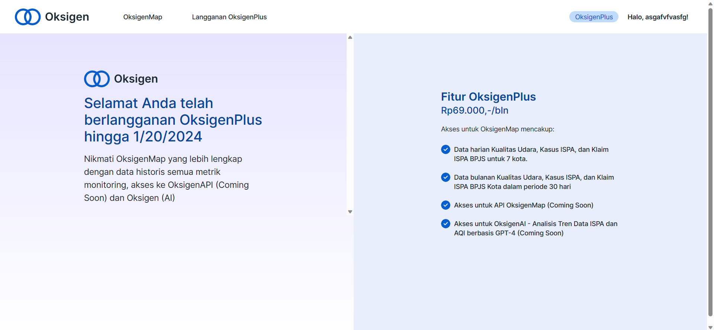
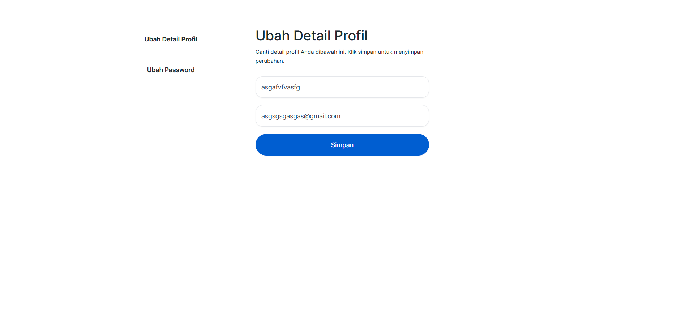
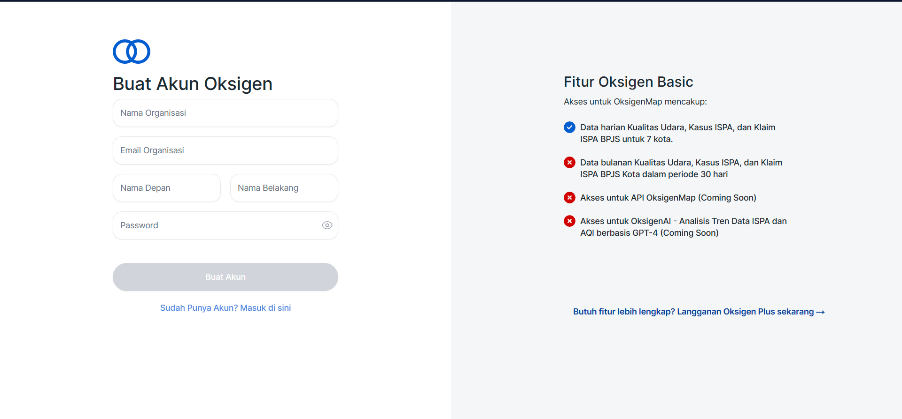
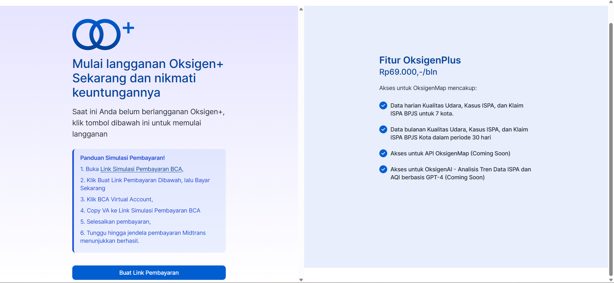
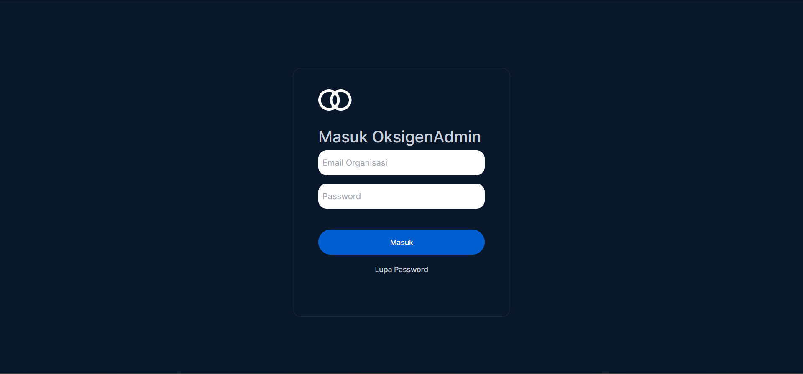
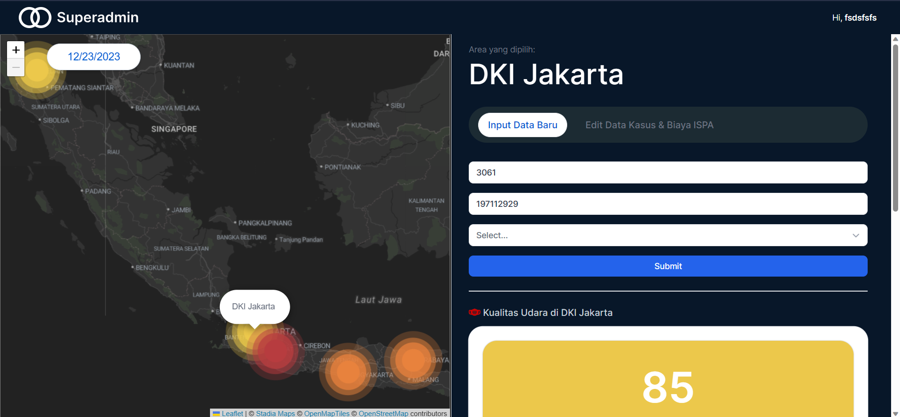

# [Oksigen](https://oksigenv-001.vercel.app/login) Web Service on Climate Action

Respiratory health is growing concern on Indonesia and International. Oksigen app is monitoring respiratory in Indonesia. Benefit if you using oksigen:
1. Realtime Air Quality Index, Areal ISPA case and BPJS claim data
2. Interactive map monitoring system
3. Historical data for all monitored Metrics 

## Let's Check Our pages
### Page for User
#### Login Page

#### Map Dashboard

#### Oksigenplus-status Page

#### Edit Profile Page

#### Reset Password Page

#### Registration Page

#### Subscribe Page

#### Payment Page from Midtrans

### Page for Admin
#### Login Page Admin

#### Admin Dashboard

