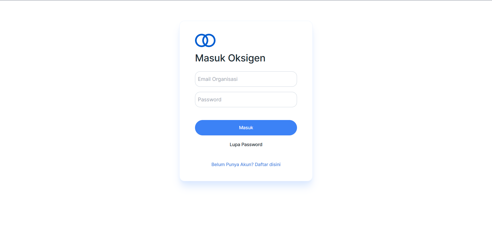
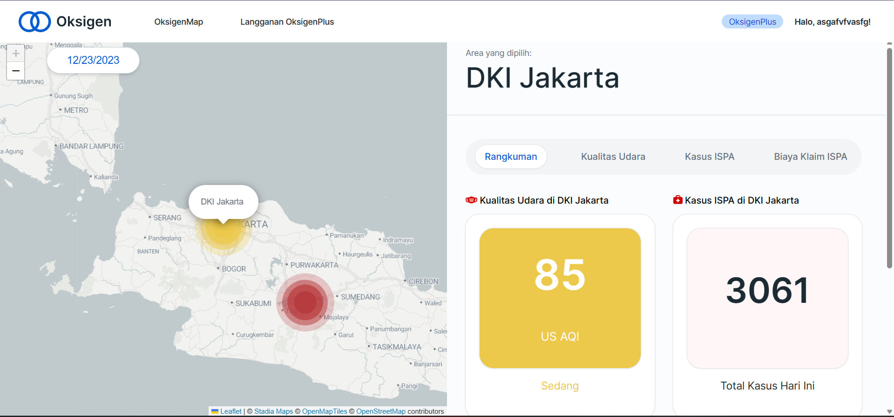
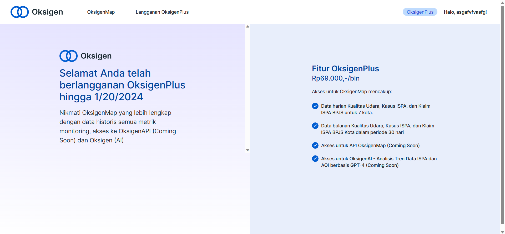
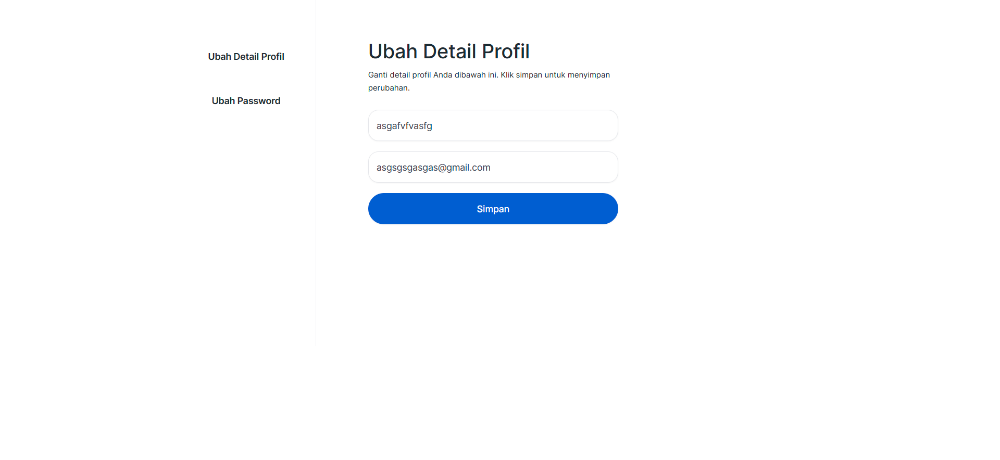
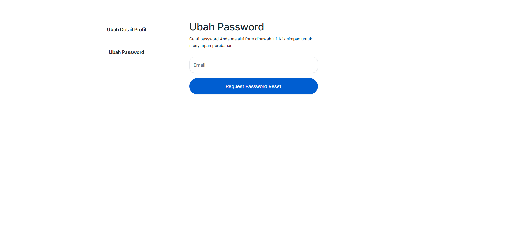
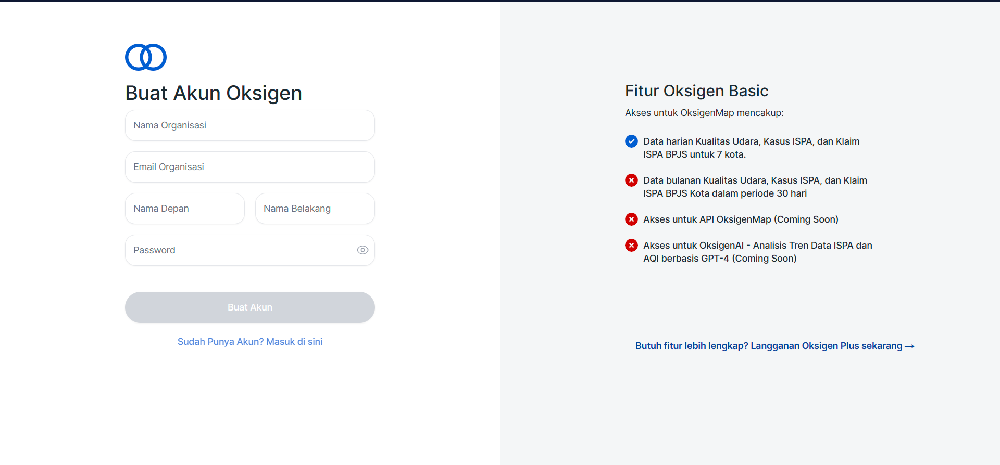
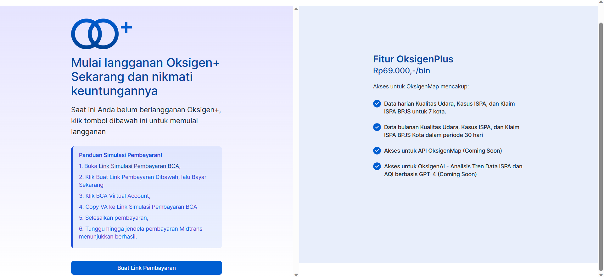
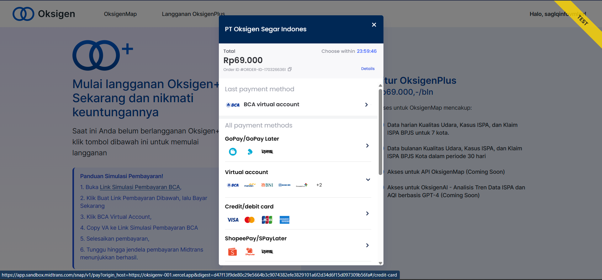
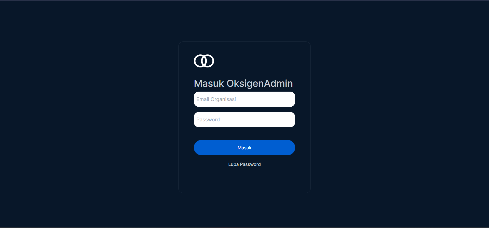
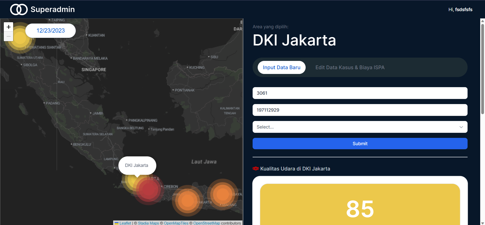

This is a [Next.js](https://nextjs.org/) project bootstrapped with [`create-next-app`](https://github.com/vercel/next.js/tree/canary/packages/create-next-app).

## Getting Started

First, run the development server:

```bash
npm run dev
# or
yarn dev
# or
pnpm dev
# or
bun dev
```

Open [http://localhost:3000](http://localhost:3000) with your browser to see the result.

You can start editing the page by modifying `app/page.js`. The page auto-updates as you edit the file.

This project uses [`next/font`](https://nextjs.org/docs/basic-features/font-optimization) to automatically optimize and load Inter, a custom Google Font.
## Next Js
Next.js is a popular open-source React framework for building web applications. It is designed to make it easy to create React applications with server-side rendering, automatic code splitting, and other performance optimizations. 

to get started with Next.js, you can install it using npm or yarn:
```bash
# Using npm
npm init next-app my-nextjs-app
# Using yarn
yarn create next-app my-nextjs-app
```

### Learn More

To learn more about Next.js, take a look at the following resources:

- [Next.js Documentation](https://nextjs.org/docs) - learn about Next.js features and API.
- [Learn Next.js](https://nextjs.org/learn) - an interactive Next.js tutorial.

You can check out [the Next.js GitHub repository](https://github.com/vercel/next.js/) - your feedback and contributions are welcome!

## Leaflet
Leaflet is an open-source JavaScript library for interactive maps. It's widely used for embedding maps on websites and web applications due to its simplicity, lightweight nature, and ease of use.

to get started with Leaflet, youn can install it using npm:
```bash
npm install leaflet
```
## Jotai 
Jotai is a state management library for React applications that leverages React's new context API and hooks. It provides a simple and flexible way to manage and share state in a React application. 
to get started with jotai, you can install it using npm or yarn:
```bash
npm install jotai
# or
yarn add jotai

```
## Tailwind
Tailwind CSS is a utility-first CSS framework that provides a set of low-level utility classes to build designs directly in your markup. It's different from traditional CSS frameworks like Bootstrap or Foundation in that it doesn't come with predefined components but offers a wide range of utility classes that you can use to construct your own designs. 

to get started with tailwind, you can install it using npm or yarn:
```bash
# Using npm
npm install tailwindcss

# Using yarn
yarn add tailwindcss
```
## JSON Web Token
JSON Web Token (JWT) is a compact, URL-safe means of representing claims to be transferred between two parties. These claims are typically used to identify the user and provide additional information about them. JWTs can be signed, optionally encrypted, and can be easily decoded both on the client and server side.

to get started with Json web token, you can install it using npm:
```bash
npm install jsonwebtoken
```
## Yup
yup is a JavaScript schema validation library for defining and validating the shape of objects. It is commonly used for form validation in web applications, allowing you to define a schema for the expected structure of your data and validate that data against the schema.
You can install yup using npm or yarn:
```bash
npm install yup
# or
yarn add yup
```
## Axios
Axios is a popular JavaScript library for making HTTP requests. It can be used both in the browser and in Node.js environments. Axios is known for its simplicity, ease of use, and features such as support for Promises and automatic request/response transformation.Axios provides a comprehensive set of features and is widely used in the development of both frontend and backend applications. 
to get started with axios, you can install it using npm or yarn:
```bash
npm install axios
# or
yarn add axios
```
## [Midtrans](https://www.midtrans.com) Client
Midtrans is a payment processing platform that provides businesses with the ability to accept and send payments online. Midtrans's API allows businesses to integrate Midtrans's payment processing capabilities into their own websites and applications, allowing them to accept and disburse payments from and to their customers easily and securely.
to get started with Midtrans Client, you can install it using npm:
```bash
npm install  midtrans-client
```
Check out our [Midtrans documentation](https://github.com/Midtrans/midtrans-nodejs-client)

## Deploy on Vercel

The easiest way to deploy your Next.js app is to use the [Vercel Platform](https://vercel.com/new?utm_medium=default-template&filter=next.js&utm_source=create-next-app&utm_campaign=create-next-app-readme) from the creators of Next.js.

Check out our [Next.js deployment documentation](https://nextjs.org/docs/deployment) for more details.

Lets checkout our pages
## Page for User
### Login Page

### Map Dashboard

### Oksigenplus-status Page

### Edit Profile Page

### Reset Password Page

### Registration Page

### Subscribe Page

### Payment Page from Midtrans

## Page for Admin
### Login Page Admin

### Admin Dashboard

